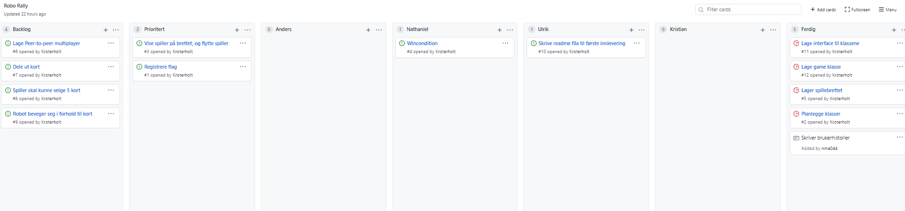

# INF112 Maven template 
##Deloppgave 1

###Kompetanse

**Kristian Oterholt** :**
Har erfaring med Java fra inf101 of inf102. Går IKT 4. semester

**Ulrik Seibt :**
Har erfaring i python (INF100).

**Nathaniel Maaskant :**
Erfaring med Java fra inf101 og inf102, litt python fra inf100, Går IKT 4. Semester

**Anders Refvik Torsvik :**
Erfaring med Java fra inf101 og inf102, litt python fra inf100, Går IKT 4. Semester

###Roller

**Teamleder:** Kristian

**Tester:** Anders

**Kundekontakt:** Nathaniel

**Nettverksansvarlig:** Ulrik

**Programmerere:** Ulrik, Kristian, Nathaniel, Anders

Kristian ble valgt som teamleder på grunn av tidligere erfaring med håndtering av større prosjekter. Anders har rollen tester fordi han viste interesse for det under første møte. Nathaniel er kundekontakt fordi han er målbevisst og har god kontroll på hva som skal prioriteres. Ulrik ble nettverksansvarlig siden han har litt erfaring med å sette opp nettverk fra før. Alle har rollen som programmer for at jobben ikke skal bli for krevende for enkeltpersoner. Disse rollene er i bruk hovedsakelig til første oblig, og vi er bevisste på at det kan endre seg i løpet av prosjektet.

## Deloppgave 2

**Prosjektmetodikk:** Kanban

Her er et utklipp av vårt projectboard på et stadie. Alle arbeidsoppgaver som blir oprettet legges i backlog, og flyttet til prioritert om de haster.
I tilleg har hvert medlem en egen kolonne hvor de flytter tingen de holder på med til, vanligvis ville ikke hvert medlem hatt en egen kolonne, men dette funker siden vi ikke er så mange.
Til slutt blir arbeidsoppgaver som er ferdig lagt i den siste kolonna.

**Møter:** Møtes fysisk mandag ettermiddag, gruppetimer onsdag,  fredag om det trengs mer arbeid på prosjektet.

**Kommunikasjon:** Vi bruker Discord og Facebook messenger til å kommunisere mellom møtene.

**Arbeidsfordeling:** Hver person tar en ting fra Project board som man jobber med omgangen. Lett å holde styr på hva som trengs. Slipper også at det blir problemer med at personer holder på med den samme tingen.

**Oppfølging:** Alle deler hva de driver med, og hvor langt de har kommet på onsdagsmøte. I tillegg kommuniserer vi gjennom discord hvor vi ligger an slik at ingen sitter fast/ligger bak.

**Deling av felles kode:** vi bruker repositorium på git og google disk mappe

## Deloppgave 3

Denne applikasjonen skal inneholde muligheten til å spille brettspillet RoboRally digitalt. Spillet vil inneholde funksjonalitet basert på brettspill-utgaven, men spesifisert av oppgaveteksten gitt av UiB. Målet er at spillet skal ha en grei spillopplevelse med mulighet for multiplayer.

####Brukerhistorie

Som spiller ønsker jeg å kunne se brettet jeg spiller på og de forskjellige brikkene på brettet for å kunne bevege meg.

####Arbeidsoppgaver
* Lage et map i programmet "Tiled"
* Spillebrettet må vises i aplikasjonen
* Spilleren må vises på brettet
* Spilleren må kunne flyttes (kun med piltastene foreløpig)

####Akseptansekriterier

Gitt at

spiller ser brettet og brikkene på det

når Spiller trykker på høyre piltast

så beveger spiller seg på brettet til høyre.

####Brukerhistorie:

Som spiller ønsker jeg å kunne besøke flagg i spillet, slik at det er mulig å vinne.

####Arbeidsoppgaver
* Flagg må vises på brettet
* Når spiller går på et flagg må dette registreres
* Når spiller har vært på alle flagg skal spiller vinne

####Akseptansekriterier

Gitt at

spiller ser brettet og kan bevege seg.

Siste flagg er på felt(6,6)

spiller er på felt(6,5)

når spiller går fra felt (6,5) til felt(6,6)

så vinner spilleren

