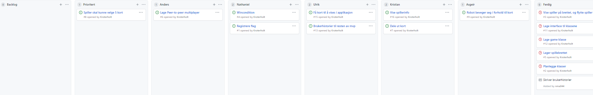

# Obligatorisk oppgave 2

###Rollene

**Teamleder:** Kristian 

**Tester:** Anders

**Kundekontakt:** Nathaniel

**Nettverksansvarlig:** Asgeir

**Møtereferat:** Ulrik

**Programmerere:** Ulrik, Kristian, Nathaniel, Anders, Asgeir

Rollene i teamet fungerer greit. Men det har blitt gjort endringer siden oblig1. På grunn av at vi alle har forskjellig erfaring slik at noen er bedre på visse ting og dermed fullføre oppgaven mer effektivt. Rollene sier noe om hvilke oppgaver man blir tildelt. F.eks nettverksansvarlig får hovedansvar for det som har med multiplayeren å gjøre osv.
Det var vanskelig å tildele roller i starten men det lønner seg når man skal organisere arbeidet og at det er litt struktur på hvem som holder på med hva istedenfor at det blir tilfeldig. Gruppedynamikken er god og vi har flytende kommunikasjon under møtene. Vi har ikke opplevd store problemer med prosjektet selv om vi alle har forskjellig erfaring. Hvis det er problemer med noe blir det tatt opp med en gang slik at det ikke bygger seg opp.

Til nå har vi greid å oppfylle alle Mvp kravene. (..prosjektmetodikk..)

Utklipp av project board under utviklingen. Oppgaver som ikke er selvinlysende er forklart med komentar som dukker opp når du klikker på den.

###Brukerhistorier med akseptansekriterier
**Mvp krav 6:** Som spiller vil jeg kunne spille sammen med andre, slik at det blir konkurranse om å vinne.

**Akseptansekriterier:**

Gitt at

spiller(1)  starter applikasjonen

spiller(2) starter applikasjonen

når spiller(1) beveger seg fra felt (0,0) til (0,1)

så vises det samme for spiller(2)

**Mvp krav 7:** Som kort vil jeg kunne bli delt ut til spilleren, slik at de har mulighet til å velge meg.

**Akseptansekriterier:**

Gitt at

man har startet et spill

når programmeringsfasen begynner

så skal spiller bli delt ut 9 kort

**Mvp krav 8:**
Som spiller vil jeg ha muligheten til å velge 5 kort, slik at jeg kan planlegge runden min.

**Akseptansekriterier:**

Gitt at

Spillet er i programmeringsfasen

spiller har blitt tildelt 9 kort å velge mellom

spiller har valgt 4 kort

når spiller velger kort 5

så kan ikke spiller velge flere kort før neste programmeringsfase

**Mvp krav 9:**

Som robot vil jeg ha muligheten til å bevege med i henhold med valgte kort, slik at jeg kan vinne spillet.

**Akseptansekriterier:**

Gitt at

Spiller er i programmeringsfasen

spiller har valgt kort 1,2,3,4,5 i kronologisk rekkefølge

kort 1 er to fram

kort 2 er snu venstre

når programmeringsfasen er over

så skal robot til spiller først bevege seg to fram og så snu til venstre.

