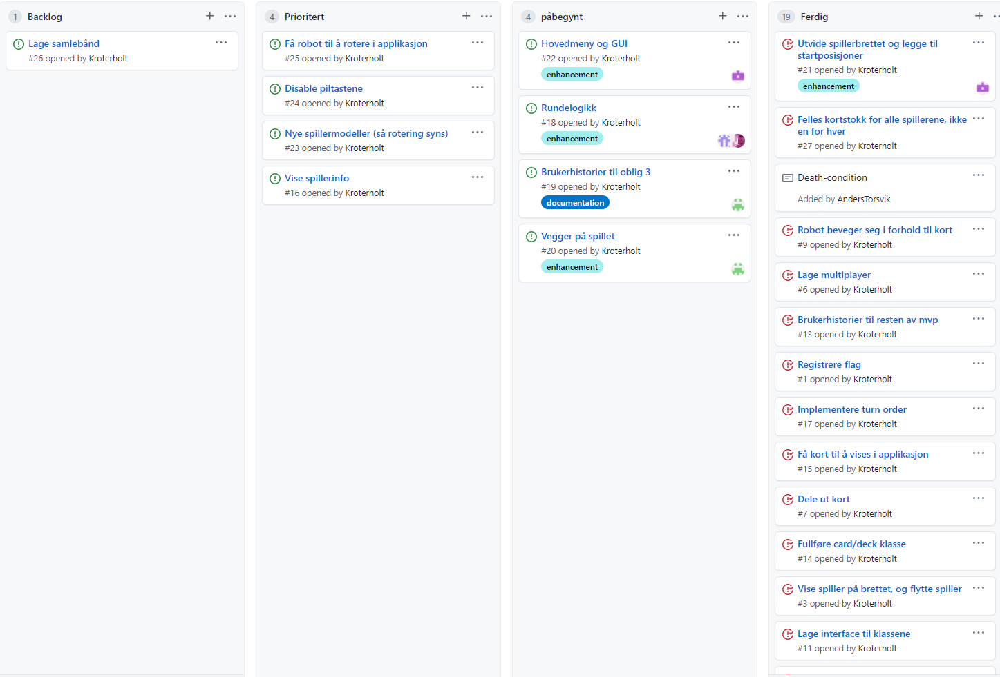

# Obligatorisk oppgave 3

### Rollene

**Teamleder:** Kristian

**Tester:** Anders

**Kundekontakt:** Nathaniel

**Nettverksansvarlig:** Asgeir

**Møtereferat:** Ulrik

**Programmerere:** Ulrik, Kristian, Nathaniel, Anders, Asgeir

Rollene i teamet fungerer bra. Vi hadde i starten av prosjektet en god diskusjon om hvordan vi skulle fordele rollene. Utenom et par endringer har mesteparten av de første utdelte rollene ikke endret seg. Vi har god teamdynamikk og det har egentlig ikke vært noen grunn til å gjøre noen endringer på rollene.

### Erfaringer:

En erfaring vi har gjort oss er at det kan bli kaotisk med bare en branch. Vi har derfor begynt å lage nye branches for større endringer til prosjektet slik at hvis vi får problemer der slipper det å påvirke master branchen. Spesielt når det skal arbeides på større klasser som f.eks Game, eller det skal gjøres endringer på multiplayeren.

### Retroperspektiv:

Til nå har vi klart å lage et fungerende RoboRalley spill med multiplayer. Vi har implementert alle Mvp-kravene samt et par metoder som forbedrer spillopplevelsen. Vi har hatt mye fokus på god teamdynamikk og som et resultat av dette er det aldri dårlig stemning eller humør under noen av møtene. Det er felles forståelse om hvordan prosjektet ligger an, slik at det er enighet om hva som skal prioriteres videre.

En ting vi har jobbet med til denne innleveringen er mer beskrivende oppgaver i project board, noe som gjør det mer oversiktlig og lettere å forstå.  Dette er noe vi planlegger å opprettholde gjennom resten av prosjektet. I tillegg ser vi at det kan mangle litt kode-kommentarer i ny og ne. Spesielt nå som prosjektet begynner å bli ganske stort er det greit å holde det organisert. Et forbedringspunkt vi har er nok derfor å bruke mer tid på kommentarer når vi skriver koden slik at det ikke må legges til i ettertid.

### Gruppedynamikk:

Vi har god gruppedynamikk. 
Ekstramøte vi har satt opp på mandag har bra oppmøte og vi opprettholder fortsatt god kommunikasjon med hverandre.
I møter hender det ofte at vi hjelper hverandre med forskjellige problemer vi har.
I mellom møter er det ikke uvanlig at en eller to i gruppen møter i discord for å teste noe. 
Arbeidet fordeles forholdsvis jevnt og alle behandles med like stor grad av respekt og er villig til å gi litt av seg selv.

### Oppdatert Project Board:

### Klassediagram:
Legger ved klassediagram som vi glemte i forige innlevering. Klassediagrammet lagde vi føre vi begynte noen som helste programering,
slik at vi hadde en god plan på hva som måtte implementeres. 
Naturligvis har programmet endret seg en del fra klassediagrammet siden vi startet, vi har for eksempel ikke en Map klasse nå.

### Brukerhistorier:

**Brukerhistorie til større brett med startposisjoner**
Som spiller ønsker jeg et stort nok brett så spilleropplevelsen blir bedre, og det skal inneholde startposisjoner.

**Arbeidsoppgaver:**
- Lage et nytt brett i tiled som er større og som inneholder startposisjoner.
- Sørge for at maploader loader det nye brettet

**Tester:**
Når du kjører spillet skal brikken din være på et 12*16 brett med startposisjonene på venstre side.

**Brukerhistorie LifeTokens:**
Som spiller vil jeg kunne gå i hull, slik at jeg kan miste liv.

**Akseptansekriterier:**

Gitt at

spiller er på posisjon (0,0)

Hull er på posisjon (0,1)

når spiller beveger seg fra (0,0) til (0,1)

så skal spiller miste 1 liv og returneres til startposisjonen.

**Arbeidsoppgaver:**
- Lage funksjon som lagrer posisjon på hull
- Lage logikk som fjerner 1 liv fra spiller som går på hull
- Oppdatere Robot.java posisjon når spiller mister 1 liv

**Brukerhistorie Death:**
Som spiller vil jeg kunne dø av å gå i hull, slik at spillet ikke blir for lett.

**Akseptansekriterier:**

Gitt at

spiller har 3 liv

det er et hull på posisjon (x,y)

når spiller går i hullet (x,y) 3 ganger

så skal spiller fjernes fra brettet

**Arbeidsoppgaver:**
- Lagre funksjon som oppdaterer spiller sine liv.
- Lage logikk som fjerner spiller fra brettet når han har 0 liv.

**Manuell test:**
Spiller skal forsvinne fra brett når han har 0 liv.

Forutsetning: Spiller må kunne gå i hull og miste liv

Test steg:
- start programmet
- gå i hull tre ganger

Forventet resultat: Spiller forsvinner fra brettet

**Brukerhistorie Meny:(ikke ferdig implementert)**
Som spiller vil jeg se en meny når jeg starter programmet, slik at jeg kan velge når jeg vil starte spillet.

**Akseptansekriterier:**

Gitt at 

spiller starter programmet

så skal en meny vises

når spiller velger "start spill"

så skal spillet starte.

**Arbeidsoppgaver:**
- Lage en meny til RoboRalley.
- Lage metode som registrerer valg og gjennomfører det.

**Brukerhistorie Rotering:(ikke helt implementert)**
Som spiller vil jeg kunne se at jeg roterer meg, slik at spillet blir lettere å forstå.

**Akseptansekriterier:**

Gitt at 

spiller kan visuelt se brikken sin peke i retning North.

spiller velger kort "turn right" i programmeringsfasen

når kort "turn right" blir spilt

så skal spiller visuelt se brikke peke i retning East.

 **Arbeidsoppgaver:**
- Knytte spiller retning (N,E,S,W) til det respektive bildet som peker den retningen.
- Lage logikk som holder kontroll på spiller sin retning.

**Manuell test:**
Spiller skal kunne rotere seg i spillet og se det

Forutsetning: spiller må kunne velge å rotere seg

Test steg:

- start spillet
- trykk enter
- vent til programmeringsfasen
- velg et roteringskort
- fullfør programmeringsfasen

Forventet resultat: Spiller roteres i henhold til kortet

**Brukerhistorie Kort i Gui (ikke implementert):**
Som spiller vil jeg kunne se kortene jeg kan velge mellom, slik at spillet blir mer intuitivt

**Akseptansekriterier:**

Gitt at

spiller har startet spillet

når programmeringsfasen starter

så skal spiller vises 9 kort å velge mellom

**Arbeidsoppgaver:**
-Knytte kortene i deck klassen til bilder av kortene i assets

**Manuell test:**
Spiller skal kunne se kortene han kan velge

Forutsetning: Spiller blir delt ut 9 kort

Test steg:
- start spillet
- trykk enter
- vent til programmeringsfasen

Forventet resultat: Spiller kan se 9 kort visuelt i Gui'en

###Refleksjon:
For denne innlevering møtte vi på en del uforventede problemer. 
Etter forrige innlevering satt vi oss ned og fant ut hvilket krav vi skulle sette til oss selv denne innleveringen, 
dette er alle brukerhistoriene beskrevet over i tilleg til ordentlig rundelogikk slik at når spillet startes, så blir det spillt ferdig som forventet, selv med flere spillere. 
Vi fant senere ut at dette innebar mer arbeidenn forventet. Vi trodde dette var et lite nok punkt til at kun ett gruppemedlem trengte å jobbe på det.
Det viste seg at dette trengte tiden til de fleste på gruppen, siden vi blandt annet måtte endre på mye av strukturen til hele prosjektet, 
og det var mye som måtte kommunisere med server.
Til neste gang skal vi lage enda mindre deloppgaver på projectboard, som er litt mer overkommelig.
Når det kommer til oppgaver rundt GUI føler vi at de er delt opp nok, men disse blir flyttet til neste innlevering,
siden vi måtte fokusere på rundelogikk, og det er mye å sette seg inn i LibGDX.

