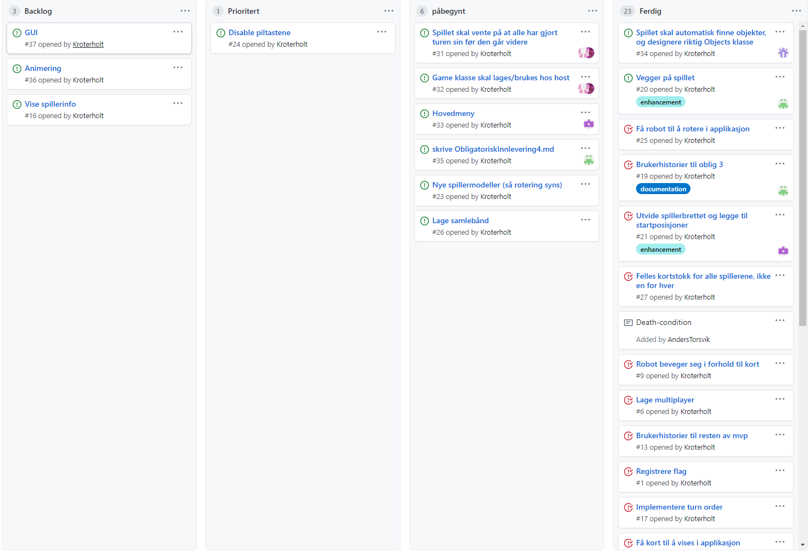

# Obligatorisk oppgave 4

### Rollene

**Teamleder:** Kristian

**Tester:** Anders

**Kundekontakt:** Nathaniel

**Nettverksansvarlig:** Asgeir

**Møtereferat:** Ulrik

**Programmerere:** Ulrik, Kristian, Nathaniel, Anders, Asgeir

Rollene vi har fungerer fortsatt veldig bra. Nå som vi har kommet så langt i prosjektet og det nærmer seg slutten er det ikke så mange flere roller som trengs. For å unngå kompliseringer og fordi vi ikke ser mye poeng i å legge til/endre rollene når de fungerer bra har vi beholdt de var i oblig3.

### Erfaringer:

Bruken av flere branches som vi nevnte i oblig3 er nok den største erfaringen vi har gjort oss. Prosjektet har vært mer oversiktlig og kontrollert siden vi implementerte det.
I tilleg har vi lært at det er viktig å 
bruke mer tid på å organisere koden for å unngå at det ligger metoder
eller kode i f.eks game.java som heller kunne vært i robot.java. Det hjelper mye senere når man skal forstå hva koden gjør eller gjøre endringer.

### Retroperspektiv:

Opp mot siste oblig har vi jobbet med å fikse problemer spillet samt implementere objekter som walls og belt. I tillegg har vi jobbet med rundelogikken/spillogikken slik at spillet fungerer mer som planlagt. En ting vi har merket og som vi hadde gjort annerledes hvis vi skulle startet på nytt er å jobbe mer jevnlig. På grunn av de satte oblig fristene endte vi opp med å jobbe mye opp mot fristene. Dette skapte litt stressende stemning opp mot oblig 3 hvor det var mye vi følte vi ikke hadde fått gjort. Opp mot denne obligen og når det kommer ting som påskeferie inn i bildet og man fort ender opp med å ikke jobbe med prosjektet på 1-2 uker.

Å jobbe jevnlig gjør også at man unngår å finne store oppgaver som krever mye mer arbeid enn man først trodde. Her er spill-logikken et bra eksempel på noe vi trodde bare trengte et par endringer men som hadde mange flere komplikasjoner når vi begynte å jobbe med det. Vi kunne sluppet dette hadde vi fordelt arbeidet utover flere uker. Vi burde også ikke hatt dødsoner som påskeferie eller uken direkte etter en oblig hvor motivasjonen for å jobbe er ganske lav.

### Gruppedynamikk:

Teamet våres fungerer bra og vi jobber effektivt sammen. Selv nå når stressfaktoren er høy kommuniserer vi bra og har det gøy mens vi arbeider. Alle blir inkludert i samtalen og vi deler planene vi har med hverandre. I starten av prosjektet kjente vi ikke hverandre så bra og det var vanskelig å vite hverandres styrker og preferanser. Det førte til at det tok et par møter før vi kom på rett bølgelengde og var mer åpne og komfortable rundt hverandre. Det at møtene for det meste var digitale spilte også en rolle. Men vi føler selv at det ikke har hindret prosjektet i stor grad utenom det sosiale aspektet.

### Oppdatert Project Board:

### Klassediagram:

### Brukerhistorier:

**Brukerhistorie Vegg**
Som spiller vil jeg kunne bli stoppet av vegger, slik at jeg må planlegge turen min rundt de.

**Akseptansekriterier:**

Gitt at

spiller er på posisjon (0,0)

Vegg er mellom posisjon (0,0) og (0,1)

når spiller beveger seg fra (0,0) til (0,1)

så skal spiller miste bli stoppet av veggen og ikke bevege seg.

**Arbeidsoppgaver:**
- lage Wall klassen
- Implementere metode for å identifisere vegger og retningen de har 
- Stoppe momentum til spiller som prøver å gå igjennom en vegg

**Brukerhistorie Belt**
Som spiller vil jeg kunne beveges av belter, slik at jeg kan gjøre mer avanserte trekk

**Akseptansekriterier:**

Gitt at

spiller er i programmeringsfasen

spiller er på posisjon (0,0)

Belte er på posisjon  (0,1) og peker mot (0,2)

spiller har 1 kort (move 1) igjen

når spiller beveger seg fra (0,0) til (0,1)

så skal spiller i neste programmeringsfase befinne seg på (0,2)

**Arbeidsoppgaver:**
- lage belt klassen
- Implementere metode for å identifisere belter på brettet
- La spiller beveges i beltets retning hvis han ender turen sin på den

###### Manuelle tester:

**Manuell test Flag:** Spiller må gå igjennom flagg i riktig rekkefølge for å vinne

Forutsetning: Det må være mer en 1 flagg på brettet

Test steg:

- trykk på enter for å starte spillet
- Gå først innom flagg nr 2
- Gå så innom flagg nr 1
- Gå innom flagg nr 2 igjen
  
 Forventet resultat: Går først innom flagg 2 så flagg 1 for å sjekke at rekkefølgen spilleren besøker flagg er riktig (Feil rekkefølge om spiller vinner etter det) Spiller skal vinne etter å besøke flagg 2 igjen.

**Manuell test Belt:** Spiller skal beveges av belte

Forutsetning: Det må være 1 belte på brettet som peker 
mot en open brikke

Test steg:

- trykk på enter for å starte spillet
- gjennomfør programmeringsfasen slik at du ender på en beltebrikke
- trykk "SPACE" for å starte neste runde

Forventet resultat: Spiller beveger seg +1 i beltets retning.

